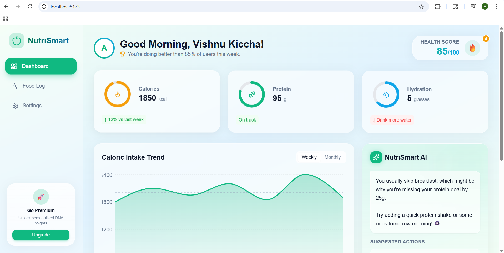
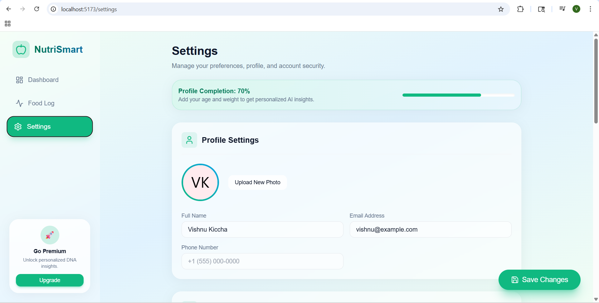
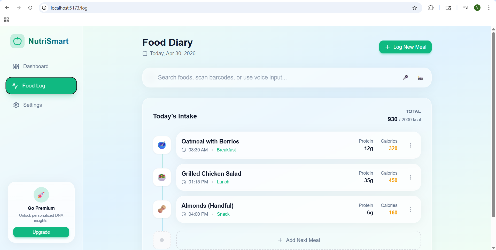

# NutriSmart AI 🥗

An AI-powered nutrition and health assistant that helps users track food, get personalized diet insights, and improve overall wellness.

## 🚀 Features
- Smart food tracking
- AI-based nutrition recommendations
- Health insights dashboard
- User profile & settings
- Clean and modern UI

## 🛠️ Tech Stack
- React (Vite)
- Tailwind CSS
- JavaScript

## 📸 Screenshots

### Dashboard

### Settings

### Food Log

## 🌐 Live Demo
(Coming soon)

## 📌 Future Improvements
- AI meal planning
- Fitness tracking integration
- Mobile app version

## 🌐 Live Demo
https://nutriapp-vishnu.web.app

---

### 👨‍💻 Developed By
Vishnu Priya B
